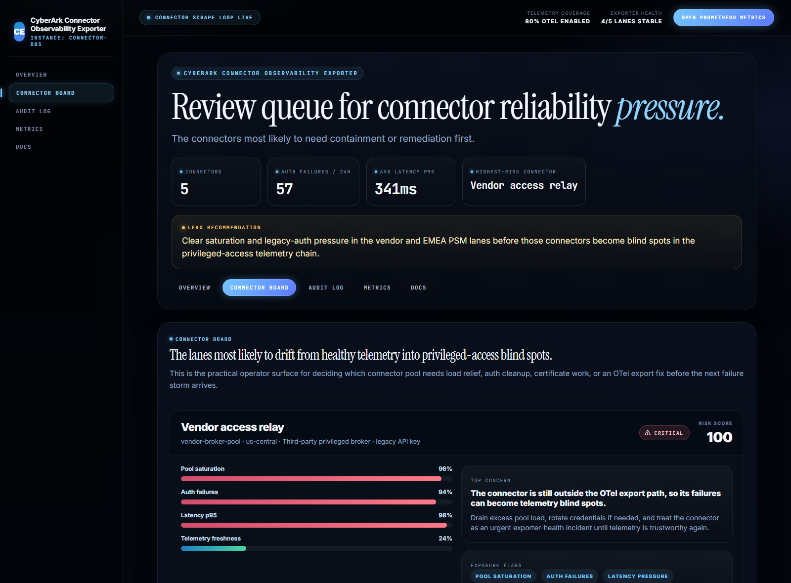
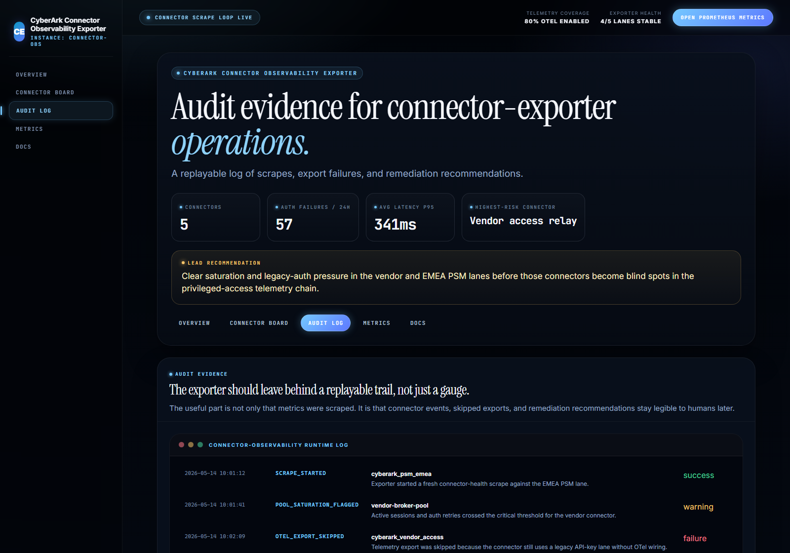
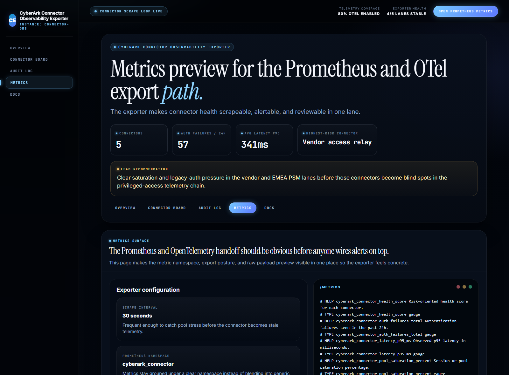
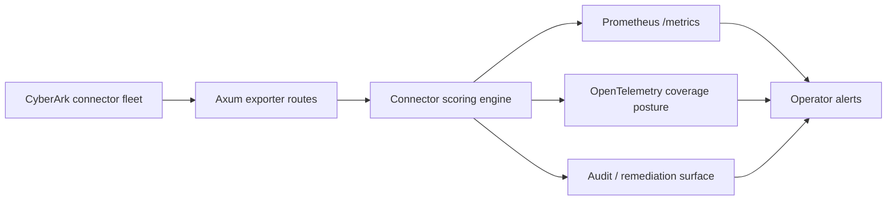

# CyberArk Connector Observability Exporter

> Rust + Axum exporter for **CyberArk connector health, pool saturation, auth failures, latency, and Prometheus / OpenTelemetry observability pipelines**.

Connector observability becomes useful only when it tells operators which CyberArk lane is failing, why it is risky, and whether the telemetry path itself is still trustworthy. This exporter models that observability layer as a Rust service with HTML proof surfaces and a Prometheus-compatible `/metrics` endpoint — the same scoring engine powers both.

## Why this exists

CyberArk estates often have strong controls around vaulting and privileged access but much weaker visibility into the connectors that make those systems operational. The hard enterprise questions are usually:

- **which connector pools are saturating** before sessions fail
- **which connectors are drifting** into auth-retry or latency pressure
- **which lanes still sit outside modern OpenTelemetry coverage**
- **which exporter signals are strong enough** to feed Prometheus alerts and audit evidence

`cyberark-connector-observability-exporter` treats connector health as a platform-reliability and security-operations concern, not just a generic metrics problem.

## What you see

A dark, operator-grade dashboard for the modeled CyberArk connector fleet — PSM, CPM, PVWA, vendor, and identity lanes — scored across pool saturation, auth failures, latency drift, telemetry freshness, credential expiry, and OTel coverage gaps. Status lanes are explicit: **healthy · watch · critical**.


The overview pairs the lead recommendation (amber callout) with four headline metrics (connectors / auth failures 24h / avg latency p95 / highest-risk connector), the modeled connector fleet, pool pressure by region, and the riskiest exporter lanes on the board.



The connector board surfaces every modeled lane with risk score, verdict pill (leading icon), and Pool saturation / Auth failures / Latency p95 / Telemetry freshness meters — plus the top concern and remediation recommendation per connector.



The audit log keeps a replayable trail of connector events, skipped exports, scrape failures, and remediation recommendations so observability work becomes review-friendly instead of living only inside a metrics backend.



The metrics preview shows the exporter configuration (scrape interval, Prometheus namespace, OTel endpoint) alongside the raw `/metrics` payload — the same shape Prometheus scrapes and OpenTelemetry exports.

## What it includes

- **Rust + Axum** exporter service with five HTML proof surfaces and seven JSON APIs
- **Modeled CyberArk connector fleet** across PSM, CPM, PVWA, vendor, and identity lanes
- **Risk scoring engine** for pool saturation, auth failures, latency drift, stale scrapes, credential expiry, and OTel coverage gaps
- **Prometheus-compatible** `/metrics` endpoint with namespaced counters / gauges
- **Audit / evidence surface** for exporter actions, skipped telemetry, and remediation recommendations
- **Exporter configuration view** for scrape cadence, namespace, and telemetry targets
- **Real browser-rendered screenshots** (via headless Edge), tests, docs, origin story, changelog, and CI

## Routes

### HTML surfaces

- `/` — Overview + lead recommendation + pool-pressure chart + top connector board
- `/connectors` — Connector review queue with risk scores, verdict pills, score bars
- `/audit` — Audit log of exporter events, skipped exports, remediation recommendations
- `/metrics-preview` — Exporter configuration + raw `/metrics` payload preview
- `/docs` — Route and payload map

### JSON APIs

```
GET /api/dashboard/summary        — connector count, degraded lanes, auth failures, lead recommendation
GET /api/connectors               — full connector fleet ordered by risk score
GET /api/connectors/{id}          — single connector with snapshot + flags + recommendation
GET /api/audit                    — audit events (scrapes, skips, remediation)
GET /api/exporter/config          — scrape interval, Prometheus namespace, OTel endpoint
GET /api/sample                   — combined snapshot of all five lanes
GET /metrics                      — Prometheus text-format payload
```

## Local run

```powershell
cd cyberark-connector-observability-exporter
$env:Path = "$env:USERPROFILE\.cargo\bin;$env:Path"
cargo run
```

Then open:

- <http://127.0.0.1:4978/>
- <http://127.0.0.1:4978/connectors>
- <http://127.0.0.1:4978/audit>
- <http://127.0.0.1:4978/metrics-preview>
- <http://127.0.0.1:4978/docs>

If the port is busy:

```powershell
$env:PORT = "4982"
cargo run
```

## Validation

```powershell
cargo test                                                  # 5 unit + integration tests
cargo build                                                 # debug build
cargo build --release                                       # release binary
powershell -ExecutionPolicy Bypass -File scripts\render_readme_assets.ps1
```

The screenshot script builds the release binary, starts it on port 4978, walks the four screenshot routes with headless Microsoft Edge at 1600px-wide viewports, and writes the four README proofs into `screenshots/`.

## Architecture



- `src/data.rs` — connector fleet seed data
- `src/engine.rs` — scoring, verdict assignment, dashboard summary, audit log, metrics payload
- `src/models.rs` — connector / snapshot / audit / config types
- `src/render.rs` — server-rendered HTML for the five proof surfaces
- `src/main.rs` — Axum routing

More detail lives in [docs/architecture.md](./docs/architecture.md).

## Docs

- [Architecture](./docs/architecture.md)
- [Origin](./docs/ORIGIN.md)
- [Changelog](./CHANGELOG.md)
