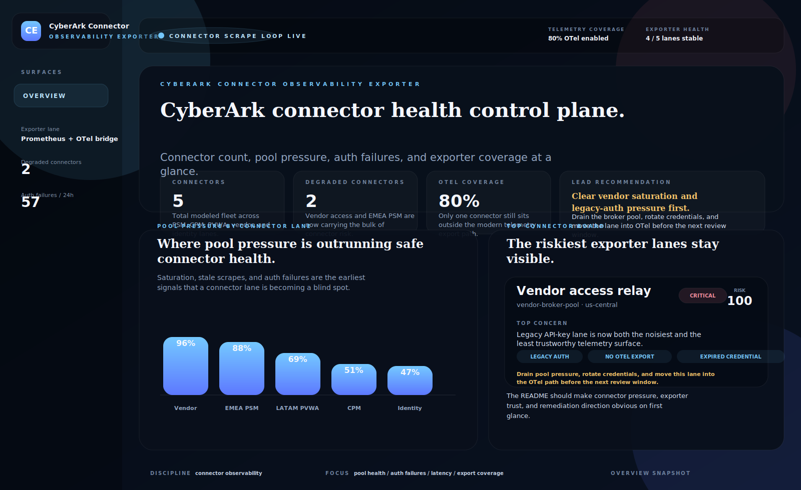
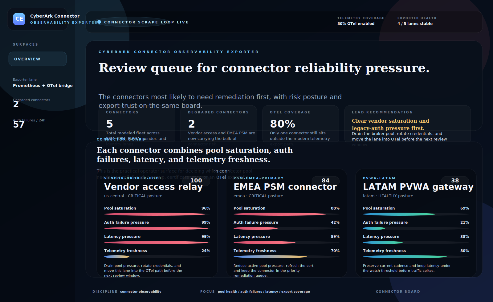
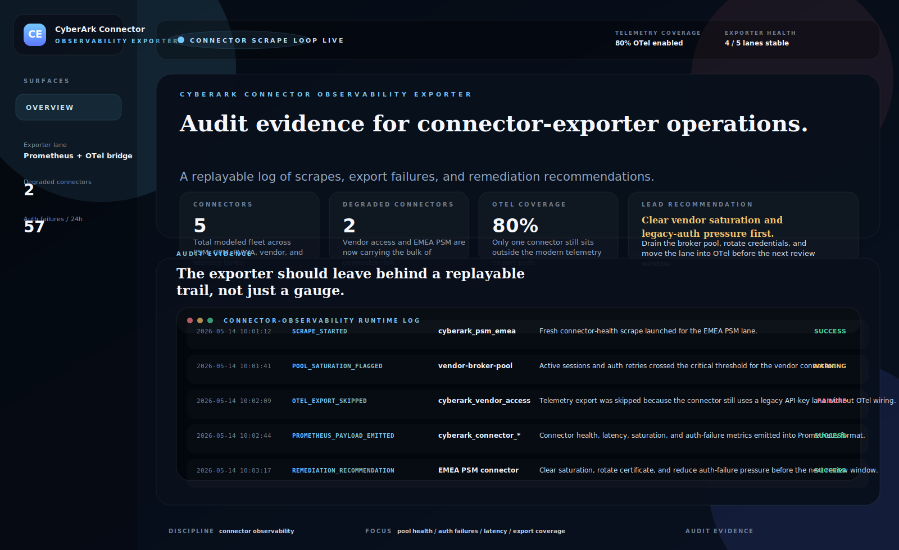
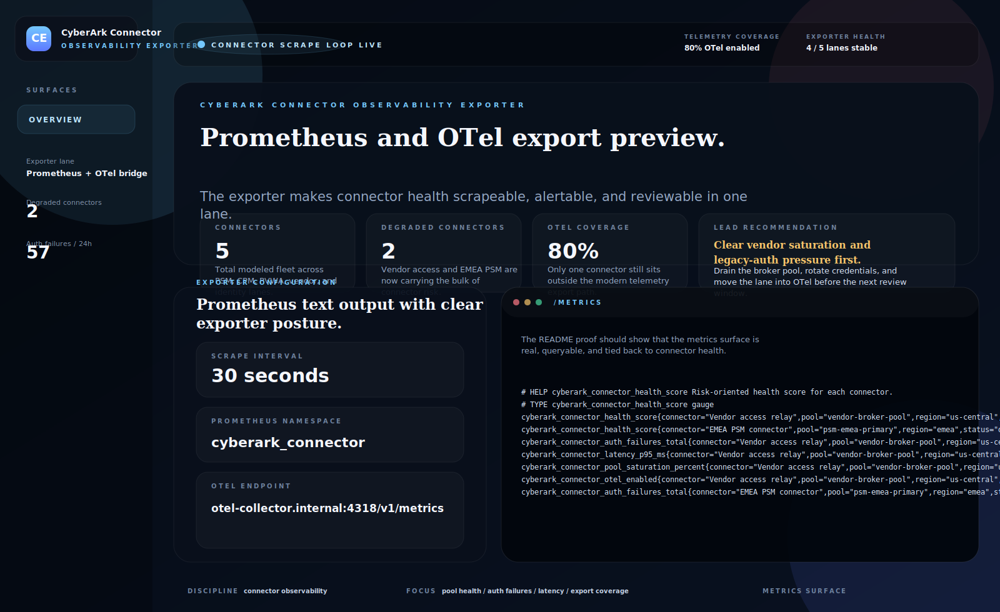
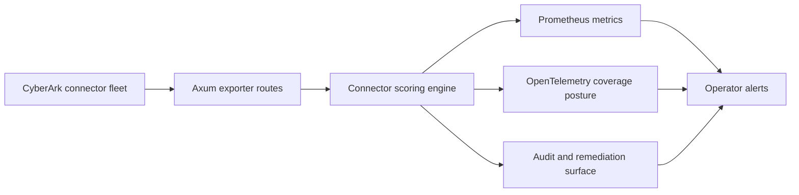

# CyberArk Connector Observability Exporter

Rust and Axum exporter for **CyberArk connector health, pool saturation, auth failures, latency, and Prometheus/OpenTelemetry observability pipelines**.

> **What this repo proves**
>
> Connector observability only becomes useful when it tells operators which CyberArk lane is failing, why it is risky, and whether the telemetry path itself is still trustworthy.

## Why this repo exists

CyberArk estates often have strong controls around vaulting and privileged access but much weaker visibility into the connectors that make those systems operational. The hard enterprise questions are usually:

- which connector pools are saturating before sessions fail
- which connectors are drifting into auth-retry or latency pressure
- which lanes still sit outside modern OpenTelemetry coverage
- which exporter signals are strong enough to feed Prometheus alerts and audit evidence

`cyberark-connector-observability-exporter` models that observability layer directly. It treats connector health as a platform-reliability and security-operations concern, not just a generic metrics problem.

## Screenshots

<p align="center">
  
</p>
<p align="center">
  
</p>

<details>
<summary>More proof surfaces</summary>

<p align="center">
  
</p>
<p align="center">
  
</p>

</details>

## What it includes

- Rust + Axum exporter service with HTML proof surfaces and JSON APIs
- modeled CyberArk connector fleet across PSM, CPM, PVWA, vendor, and identity lanes
- risk scoring for pool saturation, auth failures, latency drift, stale scrapes, credential expiry, and OTel coverage gaps
- Prometheus-compatible `/metrics` endpoint
- audit/evidence surface for exporter actions, skipped telemetry, and remediation recommendations
- exporter configuration view for scrape cadence, namespace, and telemetry targets
- screenshot generator, docs, origin story, changelog, tests, and CI

## Local run

```powershell
cd cyberark-connector-observability-exporter
$env:Path = "$env:USERPROFILE\.cargo\bin;$env:Path"
cargo run
```

Then open:

- `http://127.0.0.1:4978/`
- `http://127.0.0.1:4978/connectors`
- `http://127.0.0.1:4978/audit`
- `http://127.0.0.1:4978/metrics-preview`
- `http://127.0.0.1:4978/docs`

If that port is busy:

```powershell
$env:PORT = "4982"
cargo run
```

## Validation

```powershell
cd cyberark-connector-observability-exporter
$env:Path = "$env:USERPROFILE\.cargo\bin;$env:Path"
cargo test
cargo build
python scripts\generate_screenshots.py
```

## API routes

- `GET /api/dashboard/summary`
- `GET /api/connectors`
- `GET /api/connectors/{id}`
- `GET /api/audit`
- `GET /api/exporter/config`
- `GET /api/sample`
- `GET /metrics`

## Architecture



More detail lives in [docs/architecture.md](./docs/architecture.md).
